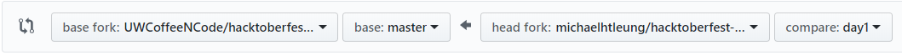

# Hacktoberfest 2018 

Repository for activities during Coffee 'N Code's Hacktoberfest 2018.

## Instructions Checklist

1.	Register for a [GitHub account](https://github.com/)
2.	Register for [Hacktoberfest](https://hacktoberfest.digitalocean.com/sign_up/register) using your GitHub account 
3.	[Pick the day](http://bit.ly/2C3XZ0t) you’ll be writing for in our protagonist’s diary
4.	[Watch this video](https://www.youtube.com/watch?v=f5grYMXbAV0) on how to fork a repository, then fork the Coffee ‘N Code “hacktoberfest-2018” repo
5.	[Watch the first 5 min of this video](https://www.youtube.com/watch?v=OVQK2zzb6U8) on how to make a new branch and commit changes to your forked repo, then create a branch structured “day#” with the day you chose in step 3 and commit your diary entry 
6.	[Read this article](https://help.github.com/articles/creating-a-pull-request-from-a-fork/) on how to make a pull request, then make a pull request that looks similar to the following image

7.	Let someone on the committee know about your pull request so they can approve it
8.	See your contribution made under the branch named “master” in the Coffee ‘N Cod repo (not your forked repo)

9. ???
10. Profit $$$