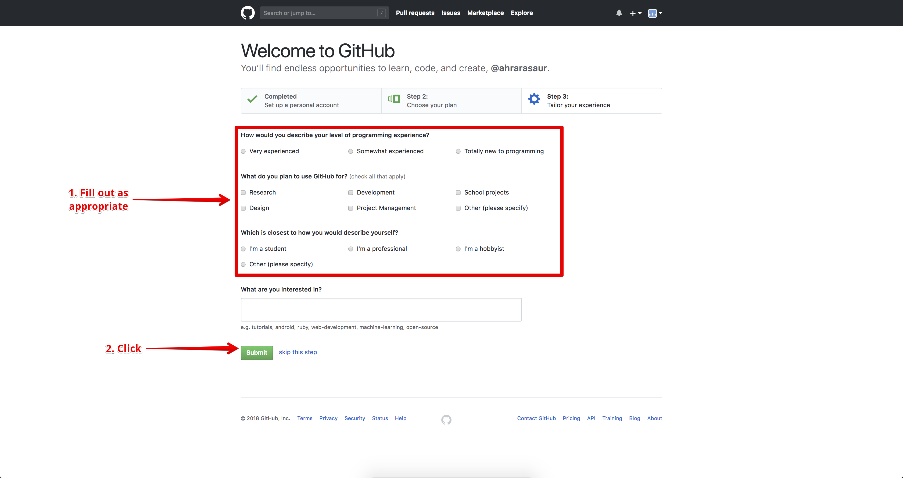

# How to create a Github Account

1. Navigate to [GitHub](https://github.com/).

2. Choose a username, email, and pass word, and click the button to sign up. 

3. You will be sent a verification email. Use the link in the email to arrive at this screen, where you will click the "Create an account" button.

4. Fill in information about your profile and submit.

5. Congratulations! You have successfully created a Github account! If you wish, you can click the "Read the guide" button to learn more about the Git program and Github.

