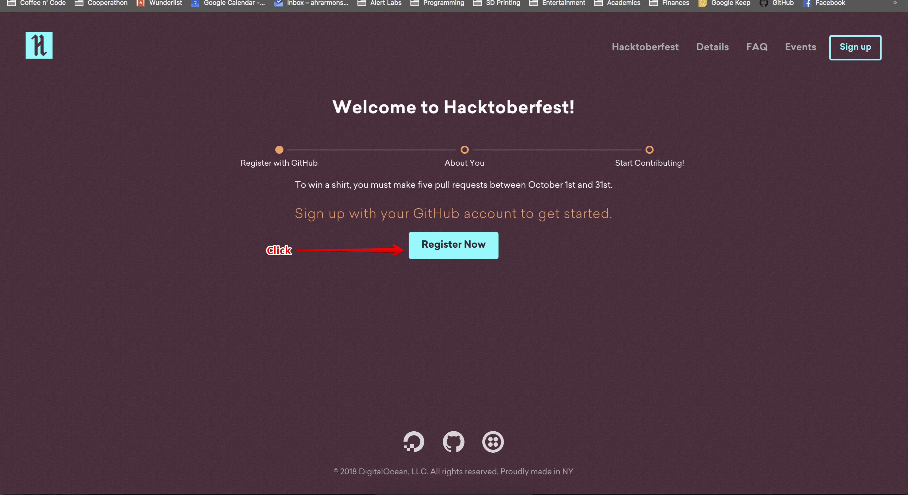
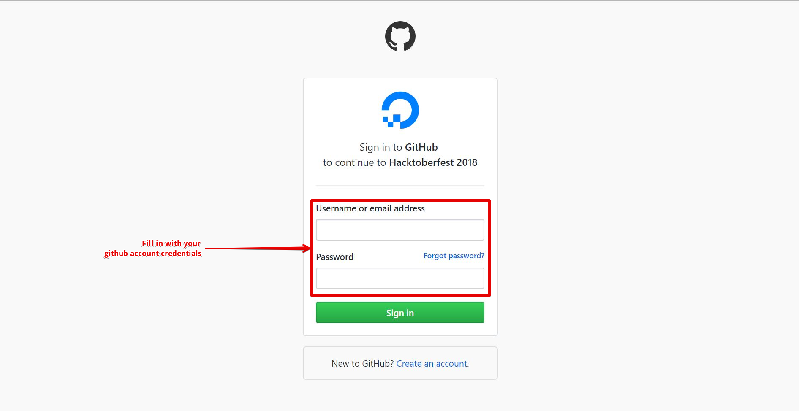

# How to register for Hacktoberfest

1. Navigate to the [Hacktoberfest Site](https://hacktoberfest.digitalocean.com/sign_up/register).

2. Click "Start Hacking" button to begin the registration process.

3. Click the "Register Now" button to be redirected to Github, where you will give Hacktoberfest permission to track your progress in the challenge.

4. Log in using your Github account credentials.

5. Authorize Hacktoberfest to view your account to track your progress in the challenge.

